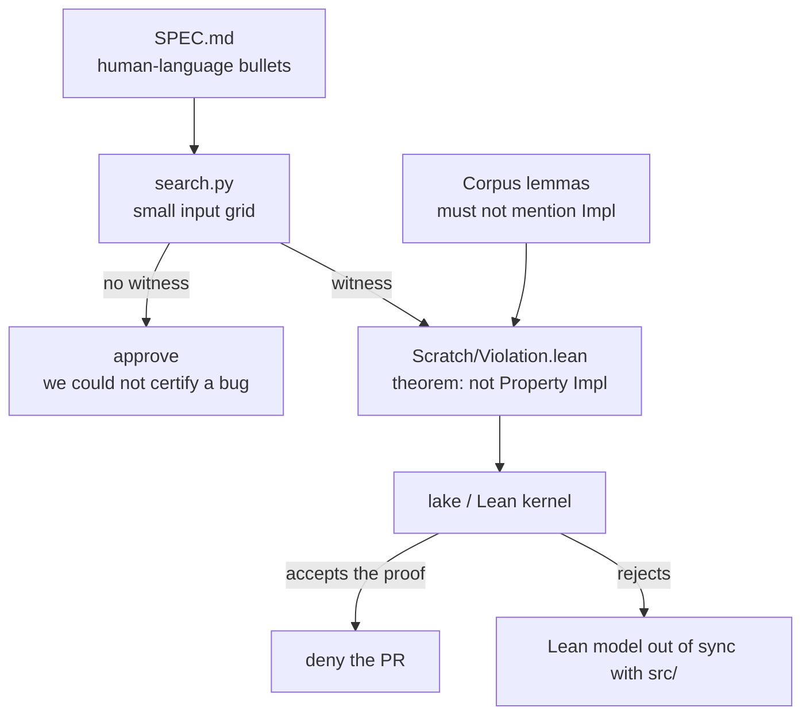
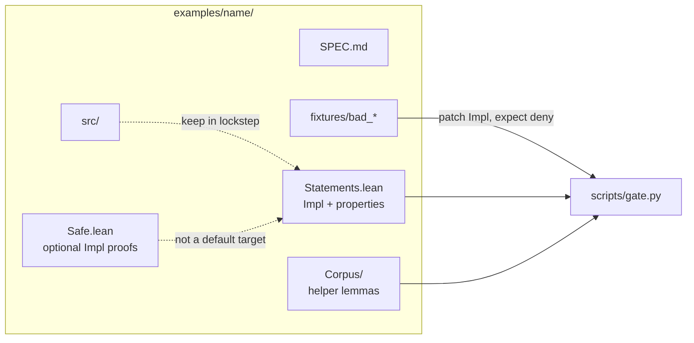
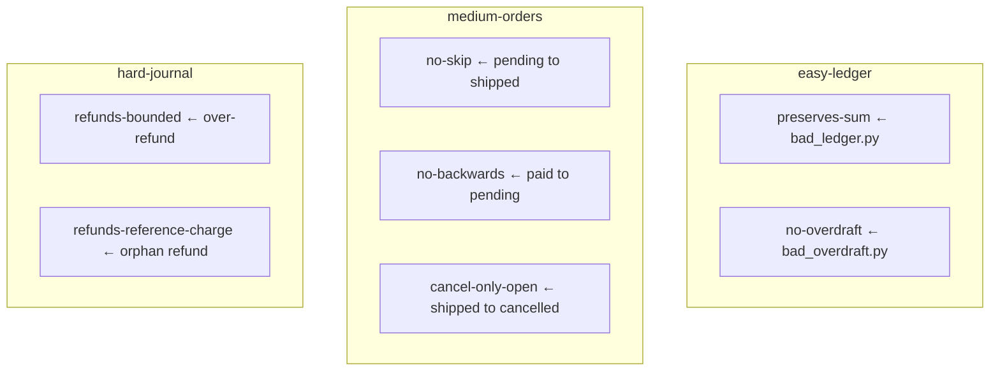
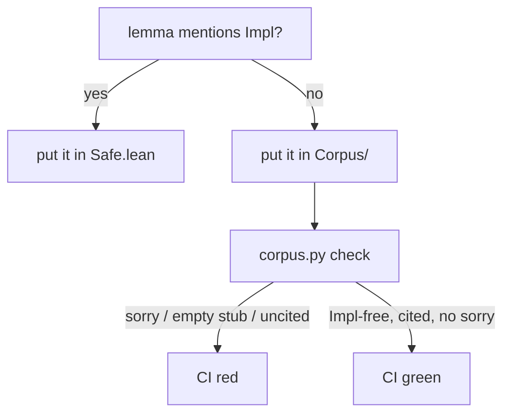

# How Noether Gate works

Open this file on GitHub (phone is fine). The diagrams render in the page.

## The deny path

CI does **not** prove the code is correct. It tries to prove a spec bullet is *violated*. If Lean accepts that proof, the PR is denied.

## What lives where

## The three examples

## Corpus rule

The deny path **mutates** `Impl` to match a bad fixture. Any lemma that mentions `Impl` then fails to build, so the certificate never typechecks.

